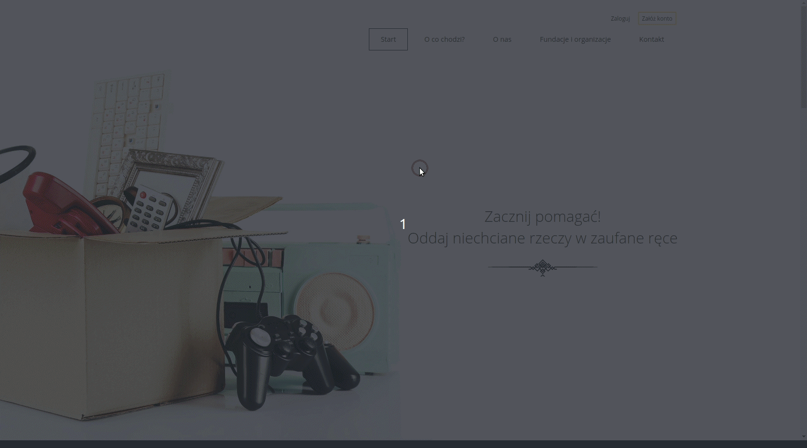
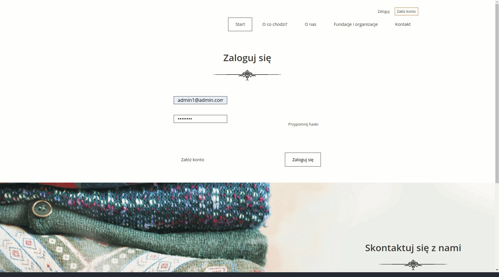

# Charity Website
> A website of a charity organization through which you can donate to the selected institution. 

## Used
+ [Maven](https://maven.apache.org/)
+ [Spring boot](https://spring.io/projects/spring-boot)
+ [Spring Security](https://spring.io/projects/spring-security)
+ [Hibernate](https://hibernate.org/)
+ [Spring Data](https://spring.io/projects/spring-data)
+ [Passay](https://www.passay.org)
+ [Lombok](https://projectlombok.org/)
+ [ModelMapper](http://modelmapper.org/)
+ [JavaMail for Spring](https://mvnrepository.com/artifact/org.springframework.boot/spring-boot-starter-mail)
+ [Spring tests](https://mvnrepository.com/artifact/org.springframework.boot/spring-boot-starter-mail)
+ [H2 Database](https://www.h2database.com/html/main.html)

## To do
+ [x] Integrate main page with db
+ [X] Make donation form
+ [X] Make user profile details and edit form
+ [X] Integrate with Spring Security
+ [X] Verify email via activation link
+ [X] Add password validation (with Passay)
+ [X] Create user and admin roles
+ [X] Create admin panel
+ [X] Add admin institutions panel
+ [X] Resend activation link
+ [X] Reset password via email
+ [ ] Add admin users panel
+ [ ] Add admin admins panel

## User profile creation with email verification via email

## Main page presentation

## Donation form

## Admin institutions panel
